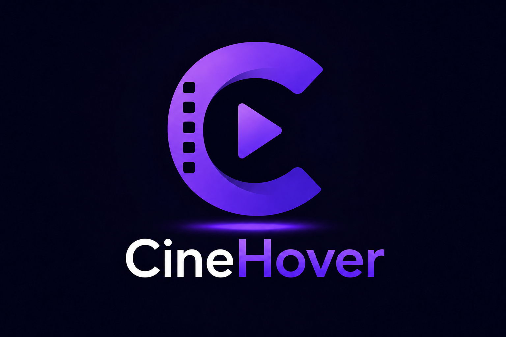

# 🎬 CineHover for Jellyfin

<p align="center">
  
  
  
  
  
  <br><br>
  <a href="https://github.com/CloudFromAbove/CineHover/releases">
    
  </a>
  <a href="https://github.com/CloudFromAbove/CineHover/releases">
    
  </a>
  
</p>

<br>

<h1 align="center">Cinematic hover previews for Jellyfin</h1>

<p align="center">
CineHover adds cinematic hover panels to Jellyfin movie and series cards.
</p>

<p align="center">
It brings trailers, backdrop previews, metadata, production flags and compact language badges directly into the Jellyfin Web browsing experience.
</p>

<br>

<p align="center">
  
</p>

---

## 🚀 Quick Start

### 1. Install the required companion plugins

CineHover currently depends on the Jellyfin frontend customization ecosystem.

Required:

- [JavaScript Injector](https://github.com/n00bcodr/Jellyfin-JavaScript-Injector)
- [File Transformation](https://github.com/IAmParadox27/jellyfin-plugin-file-transformation)

> [!IMPORTANT]
> **Jellyfin 10.11+ is required.**
>
> CineHover is currently built for Jellyfin 10.11 and newer.

### 2. Add the CineHover plugin repository

In Jellyfin:

```text
Dashboard → Plugins → Repositories → Add
```

Repository URL:

```text
https://raw.githubusercontent.com/CloudFromAbove/CineHover/main/manifest.json
```

Then install CineHover from:

```text
Dashboard → Plugins → Catalog
```

### 3. Restart the full Jellyfin service or container

> [!IMPORTANT]
> After installing or updating CineHover, restart the entire Jellyfin container or system service.
>
> A restart from the Jellyfin web interface may not be enough for the automatic JavaScript Injector registration to run.

For Docker installations:

```bash
docker restart jellyfin
```

Replace `jellyfin` with your container name.

### 4. Check JavaScript Injector

After the full restart, JavaScript Injector should show a plugin script named:

```text
CinemaHover Loader
```

If it does not appear, see [Troubleshooting](#-troubleshooting).

---

## 📸 Preview

<div align="center">
<table>
<tr>
<td align="center">

<sub>Local trailers</sub>


</td>
<td align="center">

<sub>Youtube trailers (the buttons disappear after a few seconds)</sub>


</td>
</tr>
</table>

<details>
<summary>▶️ <b>Show Preview Video</b></summary>
<br/>


</details>

</div>

---

## ✨ Features

### 🎞️ Cinematic hover panels

- Hover panels on movie and series cards; episodes are intentionally excluded
- Trailer or backdrop preview depending on available metadata and settings
- Metadata display with title, overview, runtime, director and year

### ▶️ Trailer support

- Local and YouTube trailer support
- Option to prefer local trailers
- Configurable preload behavior

### 🏷️ Visual metadata

- Production country flags
- Compact language badges
- Configurable badge separator

### ⚙️ Configuration

- French and English settings interface
- Configurable open / close delays
- Hover safe margin and z-index adjustment
- Debug logs and JavaScript Injector auto-registration toggle

<details>
<summary><strong>Show detailed behavior</strong></summary>

CineHover loads a frontend script inside Jellyfin Web through JavaScript Injector.  
The plugin then binds hover behavior to Jellyfin movie and series cards.

The hover panel can display:

- trailer or backdrop
- title
- director
- overview
- runtime
- production year
- country flags
- language badges

</details>

---

## 🌍 Available languages

CineHover currently supports two interface languages:

| Language | Status |
|---|---:|
| French | ✅ Available |
| English | ✅ Available |

The language setting affects the plugin configuration interface and hover labels.

### Language badges

CineHover also displays compact media-language badges based on Jellyfin audio and subtitle metadata.

| Native language | Possible badges |
|---|---|
| French | `VF`, `VO`, `VOST` |
| English | `Dub`, `Original`, `Sub` |

> Badge detection depends on the quality of your Jellyfin metadata, audio stream language tags and subtitle stream language tags.

---

## 🧩 Compatibility

### Jellyfin version

| Jellyfin version | Support |
|---|---:|
| 10.11+ | ✅ Supported |
| 10.10 and older | ❌ Not supported |

### Jellyfin clients

| Client | Status | Notes |
|---|---:|---|
| Jellyfin Web | ✅ Supported | Main target |
| Desktop browser | ✅ Supported | Recommended |
| Mobile web | ⚠️ Limited | Hover behavior may not be useful |
| Android / iOS apps | ⚠️ Depends | Only if they use the Web UI |
| Android TV | ❌ Unsupported | Native client |
| Third-party clients | ❌ Unsupported | Not based on Jellyfin Web |

### Companion plugin compatibility

CineHover is currently compatible with:

- [MediaBar](https://github.com/prayag17/Jellyfin-MediaBar)
- [Jellyfin Enhanced](https://github.com/n00bcodr/Jellyfin-Enhanced)

Required companion plugins:

- [JavaScript Injector](https://github.com/n00bcodr/Jellyfin-JavaScript-Injector)
- [File Transformation](https://github.com/IAmParadox27/jellyfin-plugin-file-transformation)

---

## 🧠 How it works

CineHover is a Jellyfin server plugin that exposes:

```text
/CinemaHover/config
/CinemaHover/client.js
/CinemaHover/style.css
```

The frontend layer is loaded into Jellyfin Web through JavaScript Injector.

When JavaScript Injector supports plugin script registration, CineHover can automatically register a minimal loader. This loader only loads same-origin resources from your Jellyfin server:

```text
/CinemaHover/style.css
/CinemaHover/client.js
```

No Jellyfin token, API key, local address or user-specific data is embedded in the injected loader.

<details>
<summary><strong>Manual loader fallback</strong></summary>

If automatic registration does not work, you can manually add this loader to JavaScript Injector:

```js
(function () {
    "use strict";

    const VERSION = "manual-loader";

    function loadCinemaHoverCss() {
        if (document.getElementById("cinema-hover-css")) {
            return;
        }

        const link = document.createElement("link");
        link.id = "cinema-hover-css";
        link.rel = "stylesheet";
        link.href = "/CinemaHover/style.css?v=" + encodeURIComponent(VERSION);
        document.head.appendChild(link);
    }

    function loadCinemaHoverScript() {
        if (document.getElementById("cinema-hover-client")) {
            return;
        }

        const script = document.createElement("script");
        script.id = "cinema-hover-client";
        script.src = "/CinemaHover/client.js?v=" + encodeURIComponent(VERSION);
        script.defer = true;
        document.head.appendChild(script);
    }

    function init() {
        loadCinemaHoverCss();
        loadCinemaHoverScript();
    }

    if (document.readyState === "loading") {
        document.addEventListener("DOMContentLoaded", init, { once: true });
    } else {
        init();
    }
})();
```

</details>

### Section targeting

CineHover can use Jellyfin section markers to identify where hover behavior should apply.

When section numbering is available, sections can be identified with attributes and classes such as:

```html
<div class="verticalSection jf-section-1" data-jf-section="1">
```

This makes section detection more stable on customized home pages, especially with layouts that already number Jellyfin sections.

CineHover can also fall back to classic Jellyfin section detection when these markers are not present. This keeps the plugin usable on both standard Jellyfin Web pages and customized pages that expose `data-jf-section` / `jf-section-*` markers.

This system is mainly intended for internal targeting and future customization options. Episodes remain excluded from hover binding even when they appear inside a detected section.

---

## ⚙️ Configuration

CineHover includes several settings tabs:

| Tab | Purpose |
|---|---|
| General | Enable/disable CineHover and define basic device behavior |
| Trailers | Choose local trailers, YouTube trailers or backdrop fallback |
| Performance | Adjust hover opening delay, closing delay and local trailer lookup cooldown |
| Language | Choose interface language and native language used for badges |
| Advanced | Configure safe margin, z-index, debug logs and JavaScript Injector auto-registration |

---

## 🛠️ Troubleshooting

### `CinemaHover Loader` does not appear in JavaScript Injector

After installing or updating CineHover, JavaScript Injector should show a plugin script named `CinemaHover Loader`.

If it does not appear:

1. Make sure JavaScript Injector and File Transformation are installed and enabled.
2. Restart the entire Jellyfin container or system service.
3. Check JavaScript Injector again under plugin scripts.
4. If it still does not appear, use the manual loader fallback.

For Docker installations:

```bash
docker restart jellyfin
```

### Hover does not appear

Check the following:

1. CineHover is installed and enabled.
2. JavaScript Injector and File Transformation are installed and enabled.
3. `CinemaHover Loader` appears in JavaScript Injector, or the manual loader is installed.
4. The browser page was hard-refreshed after installation.
5. You are using Jellyfin Web on a browser that supports hover interactions.

### Trailers do not play

Check the following:

1. Local trailers or YouTube trailers are enabled in CineHover settings.
2. The media item has a local trailer or a remote trailer available in Jellyfin metadata.
3. Browser privacy tools, ad blockers or network restrictions are not blocking YouTube if YouTube trailers are used.

---

## ⚠️ Known limitations

- Experimental frontend injection
- May break after Jellyfin Web updates
- May conflict with custom themes or frontend plugins
- YouTube playback can be affected by browser settings, blockers or network restrictions
- Language badge detection depends on metadata quality
- JavaScript Injector and File Transformation are currently required
- Designed for Jellyfin Web only

---

## 🧑‍💻 Development

Build:

```bash
dotnet clean ./Jellyfin.Plugin.CinemaHover.csproj
dotnet build ./Jellyfin.Plugin.CinemaHover.csproj
```

Release build:

```bash
dotnet build ./Jellyfin.Plugin.CinemaHover.csproj -c Release
```

---

## 🔐 Security notes

CineHover does not intentionally embed:

- Jellyfin access tokens
- API keys
- local IP addresses
- external JavaScript URLs
- user-specific data

The JavaScript Injector loader only loads same-origin resources served by the plugin.

---

## 💬 Feedback and contributions

Suggestions, remarks, bug reports and feature ideas are welcome.

Because CineHover is still experimental, feedback from different Jellyfin setups is especially useful:

- browser compatibility
- Jellyfin theme conflicts
- trailer detection issues
- metadata / language badge problems
- layout issues on different screen sizes
- compatibility with other Jellyfin UI plugins

Feel free to open an issue or start a discussion.

---

## 🗺️ Roadmap

Possible future improvements:

- easier installation flow
- plugin repository manifest improvements
- more UI customization
- improved language detection
- better handling of Jellyfin dynamic page changes
- optional section targeting
- additional visual customization options

---

## Inspirations & acknowledgments

CineHover is inspired by the Jellyfin frontend customization ecosystem.

Special thanks and references:

- [HoverTrailer](https://github.com/Fovty/HoverTrailer) — trailer preview concept and Jellyfin hover-preview inspiration
- [Jellyfin JavaScript Injector](https://github.com/n00bcodr/Jellyfin-JavaScript-Injector) — required frontend injection mechanism
- [File Transformation](https://github.com/IAmParadox27/jellyfin-plugin-file-transformation) — required companion plugin
- [MediaBar](https://github.com/prayag17/Jellyfin-MediaBar) — tested compatible companion plugin
- [Awesome Jellyfin](https://github.com/awesome-jellyfin/awesome-jellyfin) — a great curated list to discover many other high-quality Jellyfin plugins, themes and community projects
- The Jellyfin community and plugin ecosystem

HoverTrailer already provides a mature trailer-hover plugin with many positioning and playback options; CineHover takes a more experimental visual-preview approach focused on cinematic metadata panels, language badges and local UI customization.

---

## 📄 License

This project is licensed under the GPL-3.0 license.

See [LICENSE](https://github.com/CloudFromAbove/CineHover/blob/main/LICENSE).

---

## Disclaimer

CineHover is an unofficial experimental plugin for Jellyfin.

It dynamically modifies the Jellyfin Web frontend and may require adjustments after Jellyfin updates. It is not affiliated with or endorsed by the Jellyfin project.

---

<div align="center">

### Enjoying CineHover?

If CineHover improves your Jellyfin browsing experience, you can help the project by:
⭐ Starring the repository ⦁ 🐛 Reporting bugs ⦁ 💡 Sharing ideas or feature suggestions ⦁ 🧪 Testing on different Jellyfin setups

Suggestions, remarks and compatibility feedback are welcome.

</div>
